# Stortymap: Standing #Rock

## Yuanyuan's Documendation:

2017.05.16 initial storymap

2017.05.17 Add more. Still keep the map tile added to every page(should change it once the data geojsons are ready)

## Location Spoofing - A Disobedient Geographical Practice for the Benefit of Society

**Advisor: Bo Zhao**

**What is Location Spoofing?**

Location spoofing refers to the act of intentionally falsifying one’s actual locational information. The proliferation
of location spoofing in recent years has stirred debate about the reliability and convenience of user-generated geospatial contents and the use of location spoofing as an effective countermeasure to protect individual geo-privacy and national security.

**Recent Cases**

1\. Twitter users spoofed their locations to protect against the Dakota Access Pipeline Project

[The Dakota Access Pipeline Project](https://www.usnews.com/news/us/articles/2016-09-03/oil-pipeline-protest-turns-violent-in-southern-north-dakota) has sparked protests over its proximity to sacred Native American sites and potential to contaminate drinking water, and efforts opposing it are gaining steam. The North Dakota pipeline project led to the largest gathering of Native Americans in 100 years. And the movement snowballed further Tuesday when Green Party presidential candidate [Jill Stein reportedly spray-painted a bulldozer](https://www.usnews.com/news/articles/2016-09-07/stein-gets-noticed-for-allegedly-vandalizing-a-worksite) at a pipeline work site. Sioux tribal leaders also say construction crews have destroyed [Native American cultural and burial sites](https://www.usnews.com/news/us/articles/2016-09-04/tribal-chairman-urges-avoiding-bismarck-after-pipeline-clash). Hashtags have sprung up on Twitter to protest the pipeline, such as [#NoDAPL](https://twitter.com/search?q=%23nodapl&src=tyah), [#RezpectOurWater](https://twitter.com/search?q=%23RezpectOurWater&src=tyah) (a play on "reservations"), and [#StandWithStandingRock:](https://twitter.com/search?q=%23standwithstandingrock&src=tyah)

2\. Occupying Tehran

Twitter users spoofed their locations to prevent the local protesters in Tehran not be ambushed by Iran cyber polices.

In reaction to the 2009 presidential election in Iran,dissatisfied voters who believed the election was hijacked by the Green Movement,organized several protests to take place around major squares in Tehran as well as online. Some of these online demonstrations were supported by Twitter users who established fake locations in Tehran through spoofing, rather than actually traveling there.

The government of Iran regularly monitors all activities on social media (Ansari 2012).During the campaign, social network sites were suddenly blocked and online political activity became the target for harsh criticism and reprisals from the government. In order to prevent this surveillance as well as protect the online protestors, many internationally based Green Movement supporters spread disinformation over Twitter to mislead foreign observers. Foreign supporters who were not in Iran decided to set their online locations to Tehran in order to protect those who were tweeting from Tehran.This strategy may have helped some Iranian opposition leaders avoid persecution,but it also made it impossible to understand the real impacts of Twitter on the situation of the demonstrations on the ground.

> An image clipped from Bo Zhao's dissertation

**The disobedient aspects of location spoofing for the benefit of society**

- A less/non-violent way to protest;
- A way to confuse the cyber police who wants to ambush the local protester.

**The initial ideas for geovisualization**

- The interface will be built on three.js or d3.js;
- Visualize different cases of location spoofing or focusing on one unique case (the pipeline case);
- Visualize the word cloud (as well as other text analytics) of what the participated social media users were talking about; 
- Collect real-time social media streams and store historical the data in MongoDB;
- Visualize the real-time location spoofing cases;
- Visualize polylines/curves between where the social media user locate and where the locational information is spoofed to;
- Possible virtual reality scene of the local environment of the location where gathers a lot of location spoofings;
- A possible entry point for social media users who want to spoof their online locational information in order to remotely join in the demonstration (a less violent way). 

> *“You don’t change the world by doing what you’re told.” — Joi Ito, Director, MIT Media Lab*

[MIT Media Lab Disobedience Award](https://www.media.mit.edu/disobedience/) will go to a person or group engaged in what we believe is an extraordinary example of disobedience for the benefit of society.

What does this mean? Societies and institutions lean toward order and away from chaos. While necessary for functioning, structure can also stifle creativity, flexibility, and productive change–and ultimately, society's health and sustainability. This is true from academia, to corporations, governments, the sciences, and our local communities.
With this award, we honor work that impacts society in positive ways, and is consistent with a set of key principles. These principles include *non-violence, creativity, courage, and taking responsibility for one’s actions*. This disobedience is not limited to specific disciplines; examples include scientific research, civil rights, freedom of speech, human rights, and the freedom to innovate.

The MIT Media Lab Disobedience Award seeks to highlight effective, responsible, ethical disobedience across disciplines, and around the world. Disobedience Award objectives are to build awareness and support of disobedience-robust work being done, and to promote role models for younger people.

## What I am doing now:

As you see, there are 2 cases worth studying:

Occupying Tehran is definitely location spoofing, but it happened in 2009.

Instead, Standing Rock issue is a really new topic which occured in 2016, last year. What's more, on Febrary 2017, the protest camping people are forced to leave Standing Rock area. As a reaction, they just set up a new camp in another city and calling people to join the camp. That's why it's becoming a **hot topic** again this month.
 
 

From the very beginning, our advisor suggested us to use twitter post as the data. We were trying to use hashtag like #NoDAPL #StandingRock to filter tweets. 

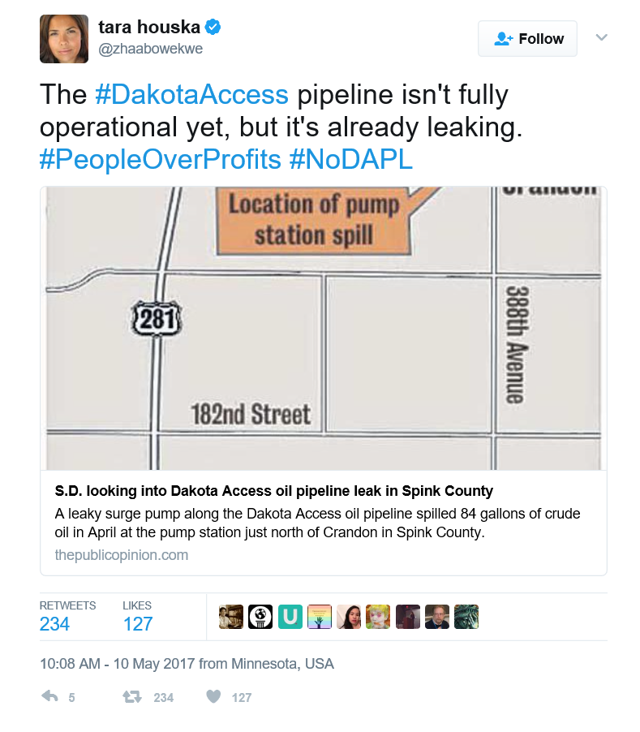 
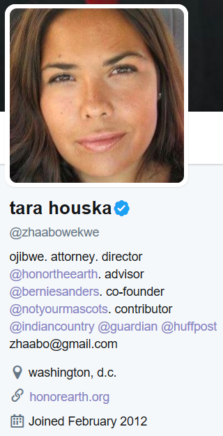
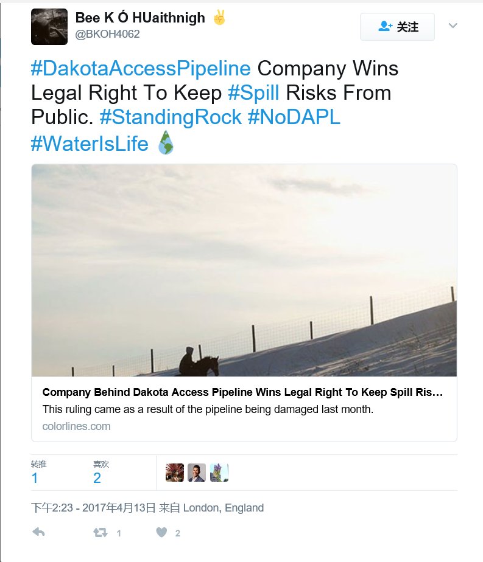
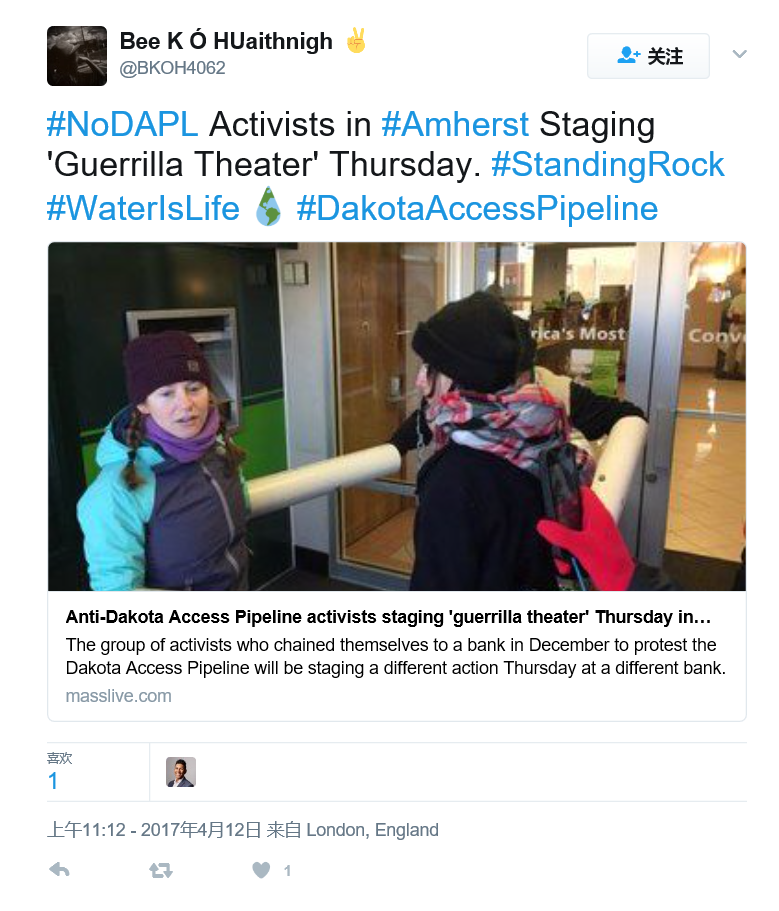
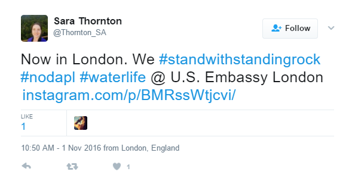
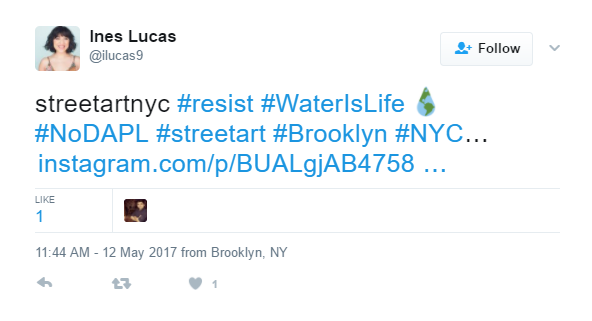
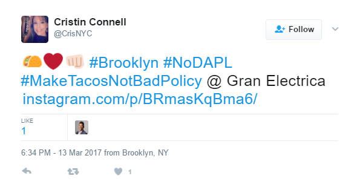
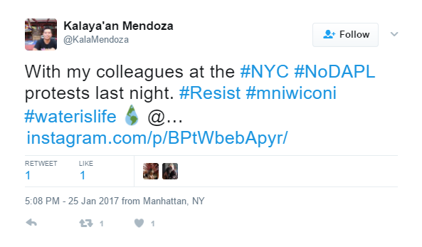
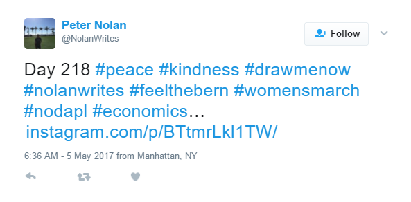
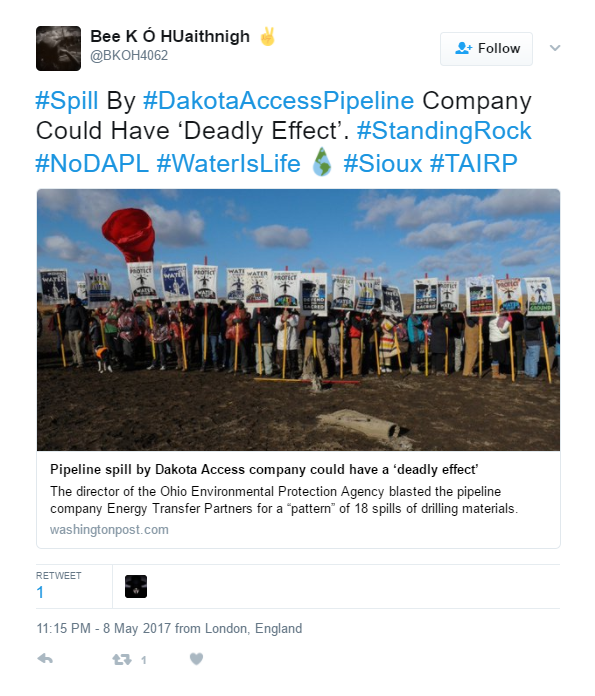
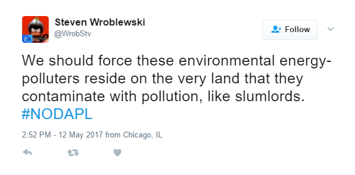
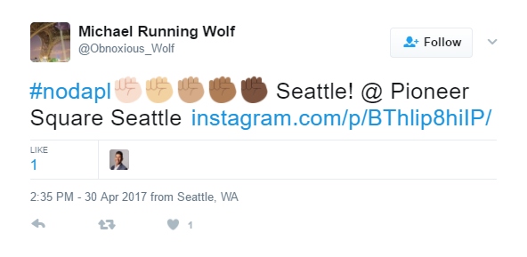

Actually, it's not a good idea because if you look through those tweets you can not find something really related to location spoofing. Fortunately, one piece of news just came into my mind:
 
[A million people 'check in' at Standing Rock on Facebook to support Dakota pipeline protestersd](https://www.theguardian.com/us-news/2016/oct/31/north-dakota-access-pipeline-protest-mass-facebook-check-in/) 

Check-in sounds like a good idea, uh? 

Then I search something like 'Standing Rock change location', it really works!

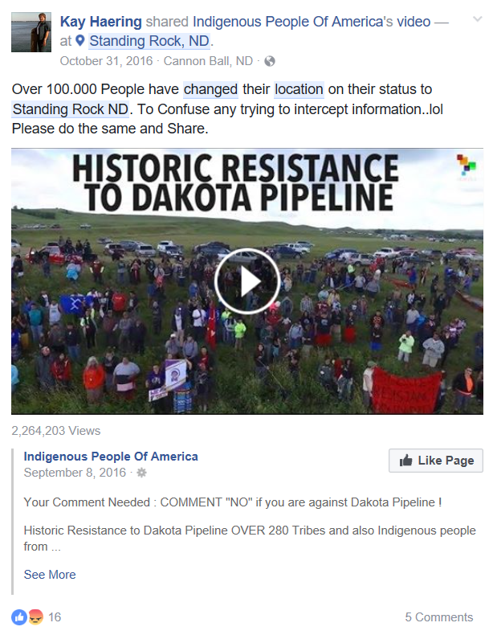
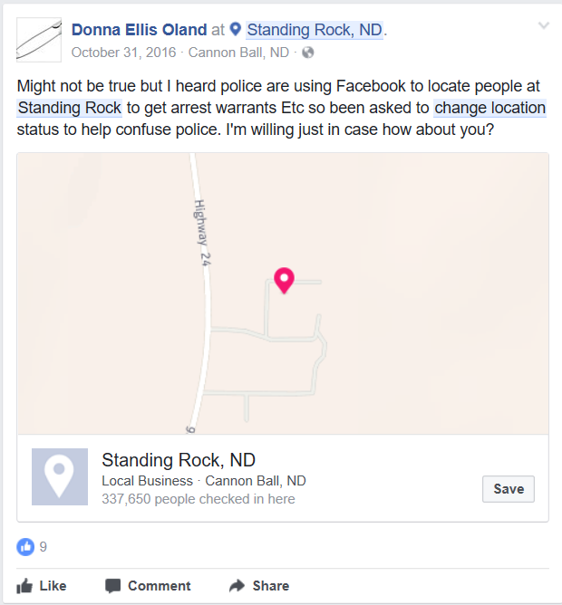

Common one:
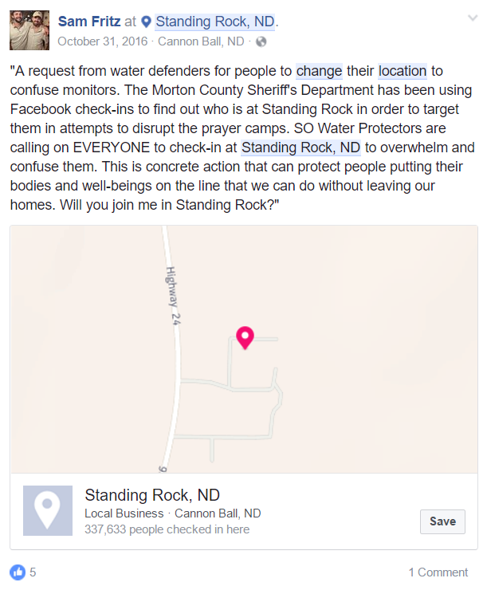

Like the posts above, people are trying to post the same content and check-in at 'Standing Rock'. Check-in means when you want to post something on Facebook, you can choose where you are, as a geo-tag. The tricky thing is, users can CHOOSE, which means they can fake the place just by searchingand clicking the destination, then the flight is achieved. BTW, even if they are pasting and posting the same content, some people just click another place named 'Standing Rock Idian Reseration'. No worries, it will be explained in my next analysis of the filter.

